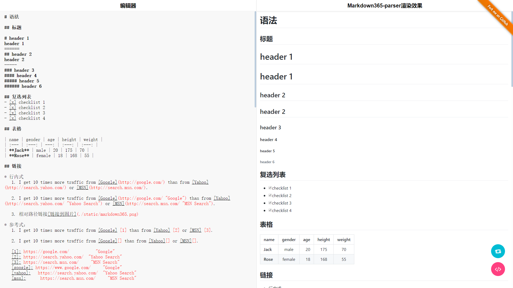

# markdown365-parser
A markdown parser library base vnode

基于vnode的markdown解析器。markdown语法解析由[marked](https://github.com/chjj/marked)扩展而来，示例地址[Github Pages](https://markdown365.github.io/markdown365-parser/)

## Install

[](https://nodei.co/npm/markdown365-parser/)

## Usage

### Browser
```html
<!doctype html>
<html>
<head>
  <meta charset="utf-8"/>
  <title>markdown365-parser</title>
  <script src="dist/markdown365-parser.js"></script>
</head>
<body>
  <div id="previiew"></div>
  <script>
    const markdwon = '## markdown365-parser'
    const parser = new Markdown365Parser({
      gfm: true,
      tables: true,
      breaks: true,
      pedantic: false,
      smartypants: false,
      base: '',
      $el: this.$refs.view
      base = '',
      $el: document.querySelector('#previiew')
    })
    parser.parse(markdown)
  </script>
</body>
</html>
```

## 支持语法

支持语法请查看[Grammar](./Grammar.md)或者[Github Pages](https://markdown365.github.io/markdown365-parser/)


## Options

* **gfm**: GitHub flavored markdown语法支持. 默认: `true`

* **tables**: GFM tables语法支持. 必须要求`gfm`为`true`. 默认: `true`

* **breaks**: GFM line breaks解析规则支持. 必须要求`gfm`为`true`. 默认: `false`

* **pedantic**: 是否尽可能遵守`markdown.pl`的部分内容. 不去掉一些不严格的内容. 默认: `false`

* **smartypants**: 是否替换特殊符号. 默认: `false`

* **base**：这里是用来指定markdwon文档中的链接地址、图片地址的前置链接，如markdown中的说有图片都指向另一个域的时候，base就可以设置为指定域名。这里这个参数主要时考虑到编写桌面markdown编辑器用的，因为编辑器打开markdown文件时，对应的图片的路径要转换为相对markdown文件所在目录的相对路径，具体可参考我的另一个项目[markdown365](https://github.com/markdown365/markdown365)

* **$el**：文档要渲染到的dom节点

## Screenshots

1. 编辑模式下
2. 与marked对比


## Licences

[MIT](./LICENSE)
